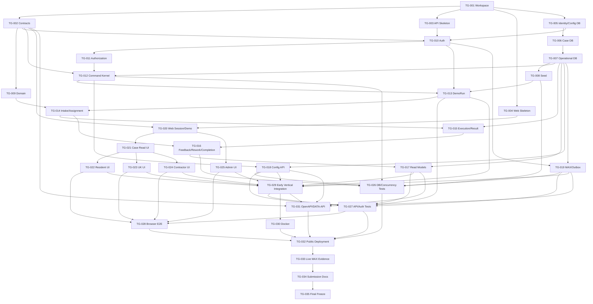

# TASK GRAPH

> Canonical approved Task Graph. `TASK_GRAPH_GATE = PASS` подтверждён independent final recheck. Документ не является Task Contract или разрешением на coding.

## 1. Baseline / Gate Status

```text
BASELINE_SHA = 821a85f651d3beda227b656c1c9d2e5f957a1628
ARCHITECTURE_GATE = PASS
TASK_GRAPH_GATE = PASS
TASK_GRAPH = APPROVED
CURRENT_GATE = TASK CONTRACTS
TASK_CONTRACTS = NOT STARTED
CODING = BLOCKED
```

Baseline preflight выполнен до анализа:

- исходный projectless workspace не был checkout целевого repository: `git branch --show-current` вернул `master`, `git rev-parse HEAD` и `git log -5 --oneline` подтвердили отсутствие commit, а `git rev-parse --show-toplevel` указал на посторонний пустой `C:/` repository;
- неизвестное локальное состояние не использовалось;
- source of truth получен как immutable GitHub archive, адресованный полным SHA `821a85f651d3beda227b656c1c9d2e5f957a1628`; GitHub commit page подтверждает существование commit `821a85f` с сообщением `docs(architecture): close technical architecture gate`, а имя archive root содержит полный SHA;
- repository tree baseline содержит только `AGENTS.md`, `README.md`, `FINAL_TARGETED_TECHNICAL_ARCHITECTURE_RECHECK.md`, `docs/*` и `tasks/*`; application code, manifests, migrations, tests и delivery artifacts отсутствуют;
- все обязательные документы прочитаны из этого SHA-addressed archive. Task Graph не строился поверх пустого `C:/` repository или другого checkout.

Нормативный статус baseline: Product Freeze и Product Spec — approved; Technical Architecture — PASS; Data Model и Interface Contracts — approved. Task Graph утверждён independent final recheck; coding blocked.

## 2. Graph Design Principles

1. **Contracts first, code second.** Каждая задача ссылается на утверждённые Product Spec, Architecture, Data Model, Interface Contracts и ADR. Никакая задача не разрешает coding-agent менять эти документы или принимать новую product/architecture semantics.
2. **Один Case — одна consistency boundary.** Lifecycle-команды сохраняют immutable `case_id`, ровно восемь states, append-only history, exact targets и `SELECT ... FOR UPDATE` serialization.
3. **Dependency boundaries важнее технических слоёв.** Например, Result, material validation и outbox intent объединены одной atomic integration boundary; outbox delivery worker остаётся отдельной задачей.
4. **File ownership закреплён заранее.** High-conflict aggregators (`package.json`, migration order, API app bootstrap, frontend router, compose, README) имеют одного владельца в конкретной wave.
5. **Только явные direct dependencies.** `Depends On` фиксирует реальные немедленные blockers; `Unlocks` является точным обратным индексом этих рёбер. Всего после targeted fix: **35 tasks / 74 direct dependency edges**.
6. **Параллелизм ограничен четырьмя lanes.** Lanes — предпочтительные области владения, не люди. В одной wave не выдаётся двум агентам право менять один high-conflict shared file.
7. **Backend authoritative.** UI использует role-filtered snapshots и `allowed_actions`, но не воспроизводит state machine, authorization или contractor actor resolution.
8. **No optimistic workflow mutation.** После success или `409` frontend refetch'ит snapshot; stale command не retarget'ится.
9. **Tests входят в каждую implementation task.** Отдельные TEST tasks добавляют cross-module matrices, real PostgreSQL races и browser E2E, но не откладывают базовые unit/contract tests «на потом».
10. **Реальный MAX отделён от test adapter.** Fake adapter разрешён только для automated tests. Он не является evidence реальной интеграции; mobile/web/proactive notification/download закрываются отдельной runtime verification task.
11. **Early vertical slice.** Первый сквозной integration checkpoint собирает реальный backend/DB/frontend/MAX adapter path сразу после готовности mandatory lifecycle, до submission hardening и live evidence.
12. **Delivery — отдельный класс.** Docker, OpenAPI, `DATA-API.yaml`, README, public deployment, evidence и submission freeze не смешиваются с domain implementation.
13. **Scope lock.** Не добавляются microservices, queues, Redis, Kubernetes, GraphQL, WebSocket/SSE, event-sourcing framework, новый IAM, девятое state, пятая role, auto-close, CRM или ГИС ЖКХ.

Execution classes:

- **A — Implementation:** код, schema, tests внутри feature boundary.
- **B — Integration:** соединение уже реализованных boundaries и deployment integration.
- **C — Runtime verification / evidence:** только проверка реальной среды и фиксация evidence.
- **D — Submission / delivery:** воспроизводимость и комплект сдачи.

Предписанная implementation file map (пути ещё не созданы):

```text
apps/api/                    Fastify deployable backend и static serving
apps/web/                    React/Vite Mini App
packages/contracts/          Zod request/response/error schemas и shared API types
packages/domain/             pure domain transition/rule functions
packages/db/                 Kysely DB types, migrations, repositories, seed
tests/integration/           real PostgreSQL/API/concurrency suites
tests/e2e/                   Playwright browser E2E
docs/evidence/               runtime/deployment evidence
```

Это file decomposition утверждённого modular monolith, а не новая topology.

## 3. Task Catalog

### TG-001 — TypeScript workspace и pinned dependency baseline

- **Goal:** создать воспроизводимую npm-workspaces основу для одного backend, одной Mini App и shared packages, с единственным lockfile и едиными build/test/typecheck scripts.
- **Type:** FOUNDATION
- **Execution Class:** A — Implementation
- **Depends On:** NONE
- **Unlocks:** TG-002, TG-003, TG-004, TG-005
- **Parallel With:** NONE
- **Primary Ownership:** LANE-A
- **File / Module Scope:** root `package.json`, `package-lock.json`, `tsconfig.base.json`, workspace configs, lint/format/test runner configs, `.gitignore`; создание только пустых boundary directories из §2.
- **Contract Sources:** Architecture §§4, 6, 21, 26; ADR-008, ADR-009, ADR-024; Hackathon Criteria §§3, 8.
- **Required Outputs:** pinned runtime/dev dependencies; deterministic install; scripts `build`, `typecheck`, `test`, `test:integration`, `test:e2e`; package boundaries без production logic.
- **Acceptance Criteria:** clean install from lockfile succeeds; workspace graph resolves; empty packages compile; dependency versions are exact/lock-pinned; no second package manager/lockfile.
- **Required Tests:** clean install check; workspace typecheck; empty build/test smoke.
- **Forbidden / Must Not:** не создавать lifecycle code, migrations, Dockerfile, role-specific apps; не добавлять Redis/queue/GraphQL/WebSocket dependencies.
- **Integration Notes:** после merge root manifests заморожены для feature agents; новые dependency requests идут через Integration Agent, а не concurrent edits.

### TG-002 — Shared HTTP/Zod contracts

- **Goal:** выразить утверждённые request/response/error/session/snapshot/command schemas в едином shared package без изменения semantics.
- **Type:** FOUNDATION
- **Execution Class:** A — Implementation
- **Depends On:** TG-001
- **Unlocks:** TG-009, TG-010, TG-012, TG-020, TG-031
- **Parallel With:** TG-003, TG-004, TG-005
- **Primary Ownership:** LANE-D
- **File / Module Scope:** `packages/contracts/**`; не владеет API routes или frontend features.
- **Contract Sources:** Data Model §§1.3–1.5; Interface Contracts §§1–33; Product Spec §§4–6, 23.
- **Required Outputs:** closed enums for 8 states/4 roles; Zod schema families for all Case commands and exact targets; configuration; DemoRun; application session and demo actor switching; comments; attachments and download capability; MAX auth/webhook; notifications; common success/error envelopes; reads, activity and `allowed_actions`; stable semantic codes.
- **Acceptance Criteria:** every Interface Contract payload has a schema; inferred TypeScript types compile; schemas reject ninth state/fifth role, missing exact targets and forbidden response shapes; error envelope cannot expose arbitrary details by default.
- **Required Tests:** positive/negative schema fixtures and serialized snapshots for every family: Case commands, configuration, DemoRun, session/demo switching, comments, attachments/download capability, MAX/webhook, notifications, common envelopes, reads/activity/`allowed_actions`; enum exhaustiveness compile test.
- **Forbidden / Must Not:** не принимать business decisions в schema transforms; не вводить generic Case PATCH; не делать `revision` обязательным CAS target.
- **Integration Notes:** backend и frontend импортируют типы только отсюда; изменение exported schema после Wave 1 требует coordinated contract change.

### TG-003 — Backend runtime skeleton, diagnostics и observability

- **Goal:** создать Fastify application skeleton с validated environment, structured logging, static-build hook и diagnostic endpoints.
- **Type:** BACKEND
- **Execution Class:** A — Implementation
- **Depends On:** TG-001
- **Unlocks:** TG-010
- **Parallel With:** TG-002, TG-004, TG-005
- **Primary Ownership:** LANE-A
- **File / Module Scope:** `apps/api/src/app/**`, единоличное владение `apps/api/src/config/**`, `apps/api/src/modules/health/**`, `apps/api/src/logging/**`.
- **Contract Sources:** Architecture §§6.2, 7, 10, 18, 20, 24–25; Data Model §§6.5, 19, 25, 35; Interface Contracts §§1.1, 1.4, 2–3, 25, 27–28, 31, 37A; ADR-008, ADR-009, ADR-016, ADR-017, ADR-018, ADR-023.
- **Required Outputs:** Fastify factory; единая typed central configuration schema/loader для `APP_ENV`, `DEMO_MODE`, `DATABASE_URL`, `APP_SESSION_SECRET`, `MAX_BOT_TOKEN`, `MAX_WEBHOOK_SECRET`, public/base application and API URLs, `BUILD_SHA`, auth freshness/default/max-age, application session TTL, notification retry/backoff/lease/attempt limits, bounded MAX timeout/subscription/worker operational settings и explicit test/fake-adapter mode; mode-aware environment validation rules; Pino redaction; `/health/live`, `/health/ready`, `/api/v1/system/info`; graceful start/stop; static asset serving seam.
- **Acceptance Criteria:** config loader is the only `process.env` boundary and exposes a readonly typed contract; production/live mode requires real secrets/URLs and forbids fake adapter, test mode permits explicit fake settings, invalid/missing/cross-field values fail before listen; live endpoint does not depend on MAX; ready fails until DB/migrations initialized; `build_sha` is machine-readable and immutable per build; logs redact Bot/session/initData/DB/file bytes.
- **Required Tests:** exhaustive env matrix for development/test/production and `DEMO_MODE`; required/optional/cross-field/bounds tests for every config key; fake-adapter production rejection; app injection tests for diagnostics; invalid env startup failure; redaction test; graceful shutdown smoke.
- **Forbidden / Must Not:** не размещать Bot Token во frontend/logs; не выполнять MAX network health as readiness blocker; не создавать business routes; не разрешать TG-010/TG-019 или другим modules читать `process.env` напрямую либо создавать ad hoc env validators/loaders.
- **Integration Notes:** feature modules consume only injected typed config from TG-003; feature modules register through plugin boundaries; only TG-029 later owns final app composition changes. TG-030 mirrors this schema in `.env.example`, but не меняет config implementation.

### TG-004 — React/Vite Mini App skeleton

- **Goal:** создать одну responsive Mini App shell с React Router, TanStack Query и MAX platform adapter seam.
- **Type:** FRONTEND
- **Execution Class:** A — Implementation
- **Depends On:** TG-001
- **Unlocks:** TG-020
- **Parallel With:** TG-002, TG-003, TG-005
- **Primary Ownership:** LANE-C
- **File / Module Scope:** `apps/web/src/app/**`, `apps/web/src/platform/**`, Vite config, base styles; central router composition остаётся владельцу TG-004 до TG-029.
- **Contract Sources:** Architecture §§6.1, 8; Product Spec §§20–21; ADR-015, ADR-025.
- **Required Outputs:** app shell; route outlet; QueryClient policy; platform adapter interface; pending/success/error primitives; responsive viewport baseline.
- **Acceptance Criteria:** one app renders in mobile/web viewport; no role-specific separate builds; query policy supports refetch after command/409/focus/manual refresh; business state is not held in a client workflow store.
- **Required Tests:** component smoke; router smoke; viewport tests; QueryClient policy unit tests.
- **Forbidden / Must Not:** не доверять `initDataUnsafe`; не добавлять optimistic state transitions, WebSocket/SSE или four-app split.
- **Integration Notes:** feature routes/components are contributed from owned directories; TG-029 alone edits final router registry after parallel frontend work.

### TG-005 — Configuration, identity и DemoRun schema foundation

- **Goal:** реализовать первую migration boundary для tenant/config/user/MAX/demo entities и их DB constraints.
- **Type:** DATA
- **Execution Class:** A — Implementation
- **Depends On:** TG-001
- **Unlocks:** TG-006, TG-010
- **Parallel With:** TG-002, TG-003, TG-004
- **Primary Ownership:** LANE-B
- **File / Module Scope:** `packages/db/migrations/*foundation*`, DB types for Organization, House, Premises, AppUser, bindings/access, MaxIdentity, Category, Contractor, OrganizationContractor, DemoRun, DemoRunActor.
- **Contract Sources:** Data Model §§3–8, 25, 26.1, 35; Architecture §§7.4, 10–12; ADR-016, ADR-017, ADR-020.
- **Required Outputs:** versioned up migration(s); exact enums/checks/partial uniques/composite keys; Kysely type surface; migration runner foundation.
- **Acceptance Criteria:** unique normal `AppUser → MaxIdentity`; `LINKED_CONFIRMED` requires delivery chat id/type; one ACTIVE DemoRun per real identity; role-binding shapes and tenant keys enforced by PostgreSQL.
- **Required Tests:** clean migrate; rollback policy test where supported; negative constraint fixtures for role shapes, MaxIdentity readiness and duplicate ACTIVE DemoRun.
- **Forbidden / Must Not:** не assume `mini_app_user_id == bot_user_id`; не store secrets; не create Case tables yet; не add fifth role.
- **Integration Notes:** subsequent migrations append new files; existing foundation migration is immutable after Wave 1 checkpoint.

### TG-006 — Case aggregate, history и workflow schema

- **Goal:** реализовать canonical relational Case model и все same-case/current-pointer/immutability constraints.
- **Type:** DATA
- **Execution Class:** A — Implementation
- **Depends On:** TG-005
- **Unlocks:** TG-007
- **Parallel With:** TG-009, TG-010, TG-020
- **Primary Ownership:** LANE-B
- **File / Module Scope:** `packages/db/migrations/*case-workflow*`, DB types for Case, CaseIteration, ContractorSelection, Assignment, Result, ResidentFeedback, Comment, CaseEvent.
- **Contract Sources:** Data Model §§9–18, 20–32; Product Spec §§3–6, 13–17, 23; Architecture §§13–17.
- **Required Outputs:** exactly-8-state enum; deferred circular Case/current iteration FK; composite same-case keys/FKs; DB-level immutability enforcement for Result, ResidentFeedback, Comment, ContractorSelection identity, immutable Assignment identity, one-way Assignment decision and append-only CaseEvent; event sequencing constraints.
- **Acceptance Criteria:** initial Case commits with non-null iteration 1; cross-Case pointers fail; one Result per iteration and one feedback per Result; prohibited UPDATE/DELETE of TG-006-owned immutable workflow facts is rejected and stored facts remain unchanged; EVT-015 requires Result and is unique; accepted Assignment may legally back Result in N+1.
- **Required Tests:** PostgreSQL constraint suite including all negative cross-Case inserts; real-PostgreSQL negative `UPDATE`/`DELETE` matrix proving immutability of Result, ResidentFeedback, Comment, ContractorSelection identity, immutable Assignment identity, one-way Assignment decision and CaseEvent; deferred FK bootstrap; same-contractor N+1 result fixture.
- **Forbidden / Must Not:** не encode state machine in triggers; не constrain Result iteration to Assignment creation iteration; не make current iteration nullable; не mutate old facts.
- **Integration Notes:** exports stable repository row types; operational tables arrive only in TG-007.

### TG-007 — Operational persistence: attachments, idempotency, outbox и config audit

- **Goal:** завершить persistence model для bytes/typed links, CommandExecution, NotificationIntent и ConfigurationChange.
- **Type:** DATA
- **Execution Class:** A — Implementation
- **Depends On:** TG-006
- **Unlocks:** TG-008, TG-012, TG-015, TG-017, TG-018, TG-019
- **Parallel With:** TG-011, TG-021, TG-025
- **Primary Ownership:** LANE-B
- **File / Module Scope:** `packages/db/migrations/*operational*`, DB types/repositories for Attachment links, CommandExecution, NotificationIntent, ConfigurationChange.
- **Contract Sources:** Data Model §§16, 18–19, 24–29, 33; Architecture §§17–19; Interface Contracts §§5, 26, 28.
- **Required Outputs:** typed attachment link integrity; production DB-level enforcement of immutable authoritative Attachment bytes, filename, `sha256` and business-meaning metadata after business association; principal-discriminated idempotency uniques/status checks; production DB-level enforcement of immutable CommandExecution principal/key/fingerprint/command identity after reservation, the sole normal `IN_PROGRESS → SUCCEEDED` transition, and immutable finalized successful canonical response; notification status/lease checks and dedupe; append-only configuration audit table.
- **Acceptance Criteria:** cross-Case attachment links fail; after business association, prohibited UPDATE of Attachment bytes, filename, `sha256` or business-meaning metadata and arbitrary DELETE are rejected and the authoritative row remains unchanged; same command key is unique per correct principal type; CommandExecution identity/fingerprint fields cannot be rewritten after reservation, only the canonical success transition can finalize it, and a successful execution's canonical response cannot be rewritten or arbitrarily deleted; `UNIQUE(result_id, notification_kind)` holds; invalid lease/status shapes fail; ConfigurationChange references CommandExecution.
- **Required Tests:** real-PostgreSQL positive/negative constraint matrix; negative UPDATE/DELETE proof for associated Attachment bytes, filename, `sha256` and business-meaning metadata; negative UPDATE/DELETE proof for successful CommandExecution principal/identity/fingerprint fields and finalized canonical response, including rejection of arbitrary deletion; allowed `IN_PROGRESS → SUCCEEDED` fixture followed by denied second transition/response rewrite; claim token/status fixtures; multipart hash persistence fixture.
- **Forbidden / Must Not:** не use filesystem as authoritative attachment store; не add external queue; не make redrive create a new intent.
- **Integration Notes:** schema is complete after this task; later tasks may add indexes only through Integration Agent review.

### TG-008 — Deterministic seed и maintenance recovery

- **Goal:** создать idempotent bootstrap seed и отдельно bounded team-only maintenance reseed для synthetic demo tenant.
- **Type:** DATA
- **Execution Class:** A — Implementation
- **Depends On:** TG-007
- **Unlocks:** TG-013, TG-026
- **Parallel With:** TG-012, TG-019, TG-022
- **Primary Ownership:** LANE-B
- **File / Module Scope:** `packages/db/src/seed/**`, `apps/api/src/maintenance/**`, seed scripts only.
- **Contract Sources:** Data Model §36; Architecture §23; Product Spec §§18–20; ADR-021, ADR-022, ADR-024.
- **Required Outputs:** deterministic IDs/business keys for 1 УК, house, premises, Resident, UK Employee/Admin, Contractor A/B employees, 2 categories, mappings/access and actor allowlist; non-public reseed command.
- **Acceptance Criteria:** repeated seed is no-op/update-safe; seed creates no completed baseline Case and no real PII/fake integration; normal repeat uses new DemoRun/new Case; reseed refuses production or `DEMO_MODE=false`.
- **Required Tests:** seed twice equality; deterministic lookup; environment guard; verify old Case is not reset by normal demo start.
- **Forbidden / Must Not:** не expose reseed as product HTTP action; не rollback migrations; не delete non-synthetic tenant data.
- **Integration Notes:** provides stable fixtures consumed by backend, frontend contract fixtures and E2E.

### TG-009 — Pure domain state machine и invariant engine

- **Goal:** реализовать pure TypeScript rules for TR-001…TR-022, target requirements, projection effects and terminal guard.
- **Type:** BACKEND
- **Execution Class:** A — Implementation
- **Depends On:** TG-002
- **Unlocks:** TG-014
- **Parallel With:** TG-006, TG-010, TG-020
- **Primary Ownership:** LANE-D
- **File / Module Scope:** `packages/domain/**`; no HTTP/SQL/MAX imports.
- **Contract Sources:** Product Spec §§4–6, 13–17, 22–24; Data Model §§20, 30–32; Architecture §§13–16.
- **Required Outputs:** closed command/state transition tables; validation result types; projection/event plans; explicit completion basis and exact target requirements.
- **Acceptance Criteria:** exactly 8 states; confirmation stays awaiting; only rework yields N+1; rejection preserves Case/iteration; same contractor survives rework; terminal mutations fail; every transition emits prescribed EVT set.
- **Required Tests:** table-driven tests for TR-001…TR-022 and INV-001…INV-041 domain-relevant rules; negative tests for ninth state, stale targets and forbidden actor/state combinations.
- **Forbidden / Must Not:** не infer time-based closure; не call DB/MAX; не collapse selected/sent/accepted; не make frontend-facing `allowed_actions` authoritative.
- **Integration Notes:** command handlers consume domain plans but still revalidate under DB lock.

### TG-010 — MAX initData auth, MaxIdentity и application session

- **Goal:** реализовать real server-side MAX bootstrap, delivery binding and short-lived signed session model.
- **Type:** MAX
- **Execution Class:** A — Implementation
- **Depends On:** TG-002, TG-003, TG-005
- **Unlocks:** TG-011, TG-013, TG-019
- **Parallel With:** TG-006, TG-009, TG-020
- **Primary Ownership:** LANE-A
- **File / Module Scope:** `apps/api/src/modules/auth/**`, `apps/api/src/modules/max-identity/**`, related repositories/tests.
- **Contract Sources:** Architecture §§7.4, 10, 25; Data Model §6.5; Interface Contracts §§2–3; ADR-016; official MAX Mini App validation source `https://dev.max.ru/docs/webapps/validation` (current source verified 2026-09-21; Task Contract must record a dated/content-hashed snapshot or explicit documentation version before implementation).
- **Required Context:** Task Contract must freeze the official canonicalization algorithm and fixture (unique parameters, URL-decoded values, exclude `hash`, lexicographic key order, `key=value` joined by LF), positive vectors and malformed/duplicate-key/expired/bad-signature/tampered negative vectors; HMAC-SHA256 key derivation/signing requirements from the pinned MAX source; a named vetted and pinned server-side crypto implementation/library with constant-time comparison; exact auth freshness default/max and application-session TTL supplied by TG-003 typed config. These choices are fixed by the Task Contract and are not delegated to the coding-agent.
- **Required Outputs:** raw initData validator with freshness; MaxIdentity upsert; normal mapping; in-memory-client Bearer session claims/signing; `POST /api/v1/auth/max`, `GET /api/v1/session`.
- **Acceptance Criteria:** invalid/expired signatures rejected; raw initData/token never logged; validated chat id/type persisted; normal mapping is deterministic; reload can bootstrap anew; Bot Token remains server-only.
- **Required Tests:** pinned official/recorded positive vectors; exact canonicalization fixture; malformed encoding/duplicate parameter/missing-field, expired/future `auth_date`, bad-signature and tampered-value vectors; freshness default/max boundary tests; session TTL/signature/version/expiry tests; redaction; unique mapping race.
- **Forbidden / Must Not:** не выбирать альтернативный protocol/canonicalization/signing algorithm; не читать `process.env` и не создавать локальную auth config strategy — только consume TG-003 typed config; не trust `initDataUnsafe`, role/client contractor id, `startapp` or equality of MAX user namespaces; не persist application token in browser storage.
- **Integration Notes:** consumes immutable typed auth/session/MAX settings from TG-003 and exposes authenticated real identity/session context; authorization rights are deliberately deferred to TG-011.

### TG-011 — Per-request authorization и role isolation

- **Goal:** реализовать backend policy layer, заново разрешающую active bindings/access for every read and inside every mutation.
- **Type:** BACKEND
- **Execution Class:** A — Implementation
- **Depends On:** TG-010
- **Unlocks:** TG-012
- **Parallel With:** TG-007, TG-021, TG-025
- **Primary Ownership:** LANE-A
- **File / Module Scope:** `apps/api/src/modules/authorization/**`; policy fixtures.
- **Contract Sources:** Product Spec §§2, 6.3, 23 INV-007…INV-043; Architecture §11; Data Model §§29.3, 34; Interface Contracts §§2.2, 30.
- **Required Outputs:** resident/UK/admin/pending contractor/current executor policies; tenant/house/premises/run filters; hidden-404 ordering; field visibility descriptors.
- **Acceptance Criteria:** revoked binding denies next request despite live token; old contractor loses list/snapshot/attachment access; pending contractor gets only acceptance context; foreign resource leaks no terminal/stale reason.
- **Required Tests:** role × state × scope matrix; revocation-next-request; cross-tenant/run guessed IDs; exact reject reason omission for Resident.
- **Forbidden / Must Not:** не union multiple bindings; не authorize by Case ID knowledge, client role or CSS; не provide historical contractor cabinet.
- **Integration Notes:** command/query services must call these policies after authoritative load; policy returns scopes, not mutable domain effects.

### TG-012 — CommandExecution transaction kernel и stale serialization

- **Goal:** создать единый command transaction runner with durable idempotency reservation, Case locks, validation order, exact-target conflict mapping and canonical replay.
- **Type:** BACKEND
- **Execution Class:** A — Implementation
- **Depends On:** TG-002, TG-007, TG-011
- **Unlocks:** TG-013, TG-018, TG-026
- **Parallel With:** TG-008, TG-019, TG-022
- **Primary Ownership:** LANE-A
- **File / Module Scope:** `apps/api/src/modules/commands/kernel/**`, `packages/db/src/transactions/**`, CommandExecution repository.
- **Contract Sources:** Architecture §§9.4, 16–17; Data Model §§18, 28–29; Interface Contracts §§4–5, 29, 32–33; ADR-013, ADR-014.
- **Required Outputs:** APP_USER/MAX_IDENTITY principal derivation; canonical JSON/multipart fingerprints; reservation/replay protocol; lock/authorization/visibility/target/state order; semantic 409 mapping.
- **Acceptance Criteria:** concurrent same key waits/replays one canonical success; changed payload/file bytes gives `IDEMPOTENCY_KEY_REUSE`; different keys serialize by Case; revision is metadata, not correctness gate; rollback leaves no business write/reservation.
- **Required Tests:** controlled concurrent reservation tests; multipart fingerprint fixtures; rollback/retry; visibility-before-stale; canonical response stores post-command revision.
- **Forbidden / Must Not:** не reserve after lifecycle validation; не auto-retry/retarget stale commands; не introduce second CAS framework.
- **Integration Notes:** all later mutating handlers must use this kernel; exceptions require Task Graph escalation.

### TG-013 — DEMO_MODE: DemoRun, actor switch и restore

- **Goal:** реализовать server-enforced current DemoRun, ровно четыре role views, concrete contractor actor resolution and cross-client restore.
- **Type:** BACKEND
- **Execution Class:** A — Implementation
- **Depends On:** TG-008, TG-010, TG-012
- **Unlocks:** TG-014, TG-027, TG-029
- **Parallel With:** TG-018, TG-023, TG-024
- **Primary Ownership:** LANE-A
- **File / Module Scope:** `apps/api/src/modules/demo/**`; DemoRun repositories/routes.
- **Contract Sources:** Product Spec §20, AC-010/055–058/076; Architecture §12, §23; Data Model §35; Interface Contracts §§3.3, 25; ADR-017, ADR-021.
- **Required Outputs:** `POST /api/v1/demo/runs`; current-run restore in bootstrap; `POST /api/v1/demo/session/actor`; server contractor actor resolver; primary Case binding service.
- **Acceptance Criteria:** one ACTIVE run per real identity; new run archives old metadata without changing Cases; role switch accepts only role view; contractor A/B resolved server-side; foreign/archived run mutations hidden/denied; `DEMO_MODE=false` returns `403`.
- **Required Tests:** concurrent Start DemoRun; reload/mobile-web bootstrap restore; exact four role views; second primary Case conflict; old-run mutation denial; not-outbound-ready start failure.
- **Forbidden / Must Not:** не switch role by client alias; не give union rights; не reset old Case; не auto-create run on bootstrap.
- **Integration Notes:** exposes stable demo session contract used by CreateCase and web shell.

### TG-014 — Intake и assignment command slice

- **Goal:** реализовать commands от CreateCase до accepted/rejected Assignment, включая config snapshots и exact-target semantics.
- **Type:** BACKEND
- **Execution Class:** A — Implementation
- **Depends On:** TG-009, TG-013
- **Unlocks:** TG-015, TG-016
- **Parallel With:** NONE.
- **Primary Ownership:** LANE-B
- **File / Module Scope:** `apps/api/src/modules/cases/commands/intake-assignment/**`, соответствующие repositories/routes.
- **Contract Sources:** Product Spec TR-001…TR-006, TR-018, TR-019, §§7–9, §16.3, INV-027, AC-001/003/005/011–013/069–074; Architecture §§11.4, 13–17; Data Model §§20, 28–31; Interface Contracts §§10–15, 20–21, 29–30.
- **Required Outputs:** CreateCase, AcceptCase, SelectContractor, SendAssignment, AcceptAssignment, RejectAssignment; EVT-001…006; projection changes; normal readiness gate and demo primary bind; explicit `REWORK` branch allowing UK to select/send a new contractor B after ReturnToRework has already created iteration N+1, while revoking contractor A's LIVE authority without a second iteration increment.
- **Acceptance Criteria:** `selected ≠ sent ≠ accepted`; contractor has no access when selected; rejection returns `ACCEPTED_BY_UK`, clears current authority, preserves iteration/Case/history; stale selection/assignment rejected; config rows locked coherently. For rework A→B: iteration is already N+1; SelectContractor(B) creates Selection B and removes A from LIVE authority/access without increment; SendAssignment(B) does not increment; B accepts and becomes current executor; iteration remains N+1; A cannot list/read/act/download on the LIVE Case.
- **Required Tests:** handler/API tests for happy/reject/reselect/same-contractor-new-assignment; dedicated rework A→B fixture and command/authorization assertions for all nine acceptance steps above, distinct from initial rejection A→B; early `MAX_DELIVERY_TARGET_NOT_READY` leaves no Case; concurrent accept||reject first-valid-wins; config deactivation race.
- **Forbidden / Must Not:** не auto-send default contractor; не create executor before accepted; не increment iteration on rejection; не reveal reject reason to Resident.
- **Integration Notes:** yields accepted current executor boundary; execution/result commands start in TG-015.

### TG-015 — Execution, comments, attachments, Result и outbox intent

- **Goal:** реализовать working phase through atomic SubmitResult, including attachment security and durable notification intent creation.
- **Type:** BACKEND
- **Execution Class:** A — Implementation
- **Depends On:** TG-007, TG-014
- **Unlocks:** TG-016
- **Parallel With:** NONE на sequential Product E2E path.
- **Primary Ownership:** LANE-B
- **File / Module Scope:** `apps/api/src/modules/cases/commands/execution/**`, `apps/api/src/modules/attachments/**`, attachment repositories; intent creation only, not worker.
- **Contract Sources:** Product Spec §§9.4–9.6, 11, 13, AC-006/021–024/032–043; Architecture §§18.1–18.2, 19; Data Model §§15–16, 19.3, 32; Interface Contracts §§15A, 16, 23, 26, 28.1–28.3.
- **Required Outputs:** AddComment; AddResultMaterial; authenticated stream; short-lived capability mint/consume; SubmitResult with ResultAttachment links, EVT-007/008/009 and one NotificationIntent.
- **Acceptance Criteria:** only current executor comments/submits; material alone never changes state; required PHOTO/FILE enforced from Case snapshot; defensive exact recipient recheck precedes Result writes; one Result/iteration and one intent/result; capabilities are scoped/expiring.
- **Required Tests:** MIME/size/hash; cross-Case link denial; old contractor download denial; capability expiry/scope; duplicate result; notification-not-ready rollback; same accepted Assignment submits in N+1 fixture.
- **Forbidden / Must Not:** не call MAX inside Case transaction; не return raw storage URL; не log bytes; не create EVT-008 for invalid result.
- **Integration Notes:** committed Result ends with `notification.status=QUEUED`; actual delivery belongs to TG-019.

### TG-016 — Feedback, clarification, rework и completion branches

- **Goal:** реализовать remaining lifecycle from Resident feedback through clarification/rework/repeat and three UK completion bases.
- **Type:** BACKEND
- **Execution Class:** A — Implementation
- **Depends On:** TG-014, TG-015
- **Unlocks:** TG-017, TG-026
- **Parallel With:** NONE на sequential Product E2E path.
- **Primary Ownership:** LANE-B
- **File / Module Scope:** `apps/api/src/modules/cases/commands/feedback-resolution/**`.
- **Contract Sources:** Product Spec §§14–17, 22, TR-008…TR-022, AC-002/004/005/014–020/025–028/063–071; Data Model §§14, 20, 30–32; Interface Contracts §§17–22.
- **Required Outputs:** confirmation, remark, clarification request/reply context, record-no-feedback, ReturnToRework, normal/no-feedback completion, disputed completion.
- **Acceptance Criteria:** one formal feedback branch; confirmation does not close; EVT-015 unique/manual/no timer; late feedback invalidates no-feedback completion; ReturnToRework creates exactly N+1 and EVT-013+014; same executor persists; disputed completion emits EVT-017 only; only UK closes.
- **Required Tests:** feedback race; late feedback after EVT-015; rework||disputed completion; late remark||completion; clarification target validation; repeated rework; completed terminal guard.
- **Forbidden / Must Not:** не auto-close; не create Case on rework; не require reaccept for same executor; не duplicate terminal event.
- **Integration Notes:** completes the authoritative command surface required for Product E2E.

### TG-017 — Role-filtered read models, activity и allowed_actions

- **Goal:** реализовать lists/snapshot/activity projections with one fact per CaseEvent and server-generated action capabilities.
- **Type:** BACKEND
- **Execution Class:** A — Implementation
- **Depends On:** TG-007, TG-016
- **Unlocks:** TG-027, TG-029, TG-031
- **Parallel With:** NONE at final backend projection checkpoint.
- **Primary Ownership:** LANE-A
- **File / Module Scope:** `apps/api/src/modules/read-models/**`, case query routes.
- **Contract Sources:** Architecture §§8.2, 9.2, 11; Data Model §§20–21, 34, 37; Interface Contracts §§6–9, 30; ADR-015.
- **Required Outputs:** `GET /cases`, `GET /cases/{id}`, optional activity pagination; responsibility/status mapper; field filtering; canonical `allowed_actions` targets.
- **Acceptance Criteria:** `Case.updated_at` is sole list freshness field; activity ordered by `event_seq` and one item/event; old Results remain; Resident never receives exact rejection/internal audit; pending/current/old contractor projections differ correctly; demo run scoped.
- **Required Tests:** snapshot golden fixtures per 4 roles and 8 states; activity de-duplication; allowed_actions exact IDs; foreign tenant/run 404; old contractor disappears.
- **Forbidden / Must Not:** не serialize full Case then hide with CSS; не calculate authorization in frontend; не sort by client timestamps.
- **Integration Notes:** freezes read contract consumed by web and OpenAPI tasks.

### TG-018 — UK Admin configuration API, audit и locking

- **Goal:** реализовать минимальный approved configuration surface with same-transaction audit and shared lock order.
- **Type:** BACKEND
- **Execution Class:** A — Implementation
- **Depends On:** TG-007, TG-012
- **Unlocks:** TG-026, TG-027, TG-029, TG-031
- **Parallel With:** TG-013, TG-023, TG-024
- **Primary Ownership:** LANE-B
- **File / Module Scope:** `apps/api/src/modules/configuration/**`; config repositories/routes.
- **Contract Sources:** Product Spec §§10, 18–19, AC-044–054; Architecture §16.4; Data Model §§29.4, 33; Interface Contracts §24; ADR-020.
- **Required Outputs:** configuration reads; Organization update; House create/update; Category create/update/default contractor; contractor binding; pre-created user role/contractor employee binding; ConfigurationChange.
- **Acceptance Criteria:** UK_ADMIN own org only; every successful mutation writes audit in same transaction; deactivation affects new actions but not Case snapshots/history; lock order serializes config races; only four roles/simple result requirements.
- **Required Tests:** admin/non-admin/cross-tenant matrix; audit before/after payload; concurrent deactivate vs Create/Select/Send; existing Case snapshot stability.
- **Forbidden / Must Not:** не build CRM/HR/invitations/offboarding; не edit Case history; не create user lifecycle or category-specific state machine.
- **Integration Notes:** frontend config task consumes only this approved API surface.

### TG-019 — MAX adapter, webhook и durable notification worker

- **Goal:** реализовать real Bot API boundary, protected webhook, subscription reconciliation and claim/lease outbox delivery/redrive.
- **Type:** MAX
- **Execution Class:** A — Implementation
- **Depends On:** TG-007, TG-010
- **Unlocks:** TG-026, TG-027, TG-029, TG-031
- **Parallel With:** TG-008, TG-012, TG-022
- **Primary Ownership:** LANE-D
- **File / Module Scope:** `apps/api/src/modules/max-adapter/**`, `apps/api/src/modules/notifications/**`, `apps/api/src/integrations/max/**`.
- **Contract Sources:** Architecture §§7.2–7.4, 18, 20, 24–25; Data Model §19; Interface Contracts §§27–28; ADR-018, ADR-023.
- **Required Outputs:** adapter interface+real implementation+fake test adapter; webhook secret verification/fast 200; open Mini App action; subscription reconcile; claim/network/finalize worker; retry/backoff/permanent failure/redrive CLI.
- **Acceptance Criteria:** Bot token uses Authorization header only; network call outside DB transaction; claim finalized only by matching token; expired lease recoverable; redrive reuses intent; webhook wrong secret rejected and handler stays under 30s contract.
- **Required Tests:** outbound request contract; webhook fixtures/secret; 429/5xx/auth classification; two-worker claim race; crash/lease reclaim; no-secret-log; reconciliation recreates missing subscription.
- **Forbidden / Must Not:** не читать `process.env` и не создавать local MAX/worker config loader — only consume TG-003 typed config; не run MAX in compose; не use fake adapter as live evidence; не roll back Result on delivery failure; не create second Result/event/intent on retry.
- **Integration Notes:** consumes TG-003 typed MAX/worker/retry/lease settings; TG-029 connects committed intents to worker; TG-033 alone closes live delivery evidence.

### TG-020 — Web auth/session shell и DEMO_MODE controls

- **Goal:** реализовать frontend bootstrap from raw MAX initData, runtime-memory session, Start DemoRun and four-view actor switch.
- **Type:** FRONTEND
- **Execution Class:** A — Implementation
- **Depends On:** TG-002, TG-004
- **Unlocks:** TG-021, TG-025
- **Parallel With:** TG-006, TG-009, TG-010
- **Primary Ownership:** LANE-C
- **File / Module Scope:** `apps/web/src/features/session/**`, `apps/web/src/features/demo/**`, shell navigation only.
- **Contract Sources:** Product Spec §20; Architecture §§7.1, 8, 10, 12; Interface Contracts §§2–3, 25.
- **Required Outputs:** Bridge raw initData bootstrap; memory token lifecycle; session error/retry; start/restore run; four role-view control; actor-switch cache invalidation.
- **Acceptance Criteria:** direct browser without trusted context cannot fabricate MAX session; reload bootstraps again; switch sends only role_view; current run/primary Case restored; control hidden/disabled outside demo; exactly four labels.
- **Required Tests:** Bridge adapter fixtures; token never written to localStorage/cookie; switch/refetch behavior; disabled demo; responsive mobile/web shell.
- **Forbidden / Must Not:** не trust client role/actor alias; не store Bot Token/session persistently; не present DEMO_MODE as production IAM.
- **Integration Notes:** exposes session hooks and role context, not business authorization logic.

### TG-021 — Case list/details, status, activity и stale UX

- **Goal:** реализовать shared Case read experience for all roles from server projections.
- **Type:** FRONTEND
- **Execution Class:** A — Implementation
- **Depends On:** TG-020
- **Unlocks:** TG-022, TG-023, TG-024
- **Parallel With:** TG-007, TG-011, TG-025
- **Primary Ownership:** LANE-C
- **File / Module Scope:** `apps/web/src/features/cases/read/**`, shared Case components.
- **Contract Sources:** Product Spec §§6–7, AC-075; Architecture §§8.2–8.5; Interface Contracts §§6–9, 29.
- **Required Outputs:** role-filtered list; Case details; semantic status/responsibility/next step; event-seq activity; attachments metadata; allowed-actions renderer registry; refresh/stale banner.
- **Acceptance Criteria:** status covers all 8 states; old iterations/results visible as permitted; `409` causes refetch+message, no auto-retry; focus/manual refresh work; one event not duplicated as separate comment/result item.
- **Required Tests:** 8-state presentation matrix; role snapshot fixtures; stale behavior; activity order/de-dup; mobile/web layouts.
- **Forbidden / Must Not:** не infer allowed actions/state transitions; не show forbidden fields; не optimistic-mutate workflow.
- **Integration Notes:** role-specific tasks add forms/actions via feature-owned slots without editing central router.

### TG-022 — Resident create, comments, feedback и attachment UX

- **Goal:** реализовать Resident path from CreateCase through access comments, Result review, confirmation/remark and download.
- **Type:** FRONTEND
- **Execution Class:** A — Implementation
- **Depends On:** TG-021
- **Unlocks:** TG-028, TG-029
- **Parallel With:** TG-008, TG-012, TG-019
- **Primary Ownership:** LANE-C
- **File / Module Scope:** `apps/web/src/features/resident/**`.
- **Contract Sources:** Product Spec §7, §11, §§13–17, AC-001/002/006/014/015/021–027/039; Interface Contracts §§10, 17–18, 23, 26.
- **Required Outputs:** create form/files; comment/clarification reply; Result view/material download; mutually exclusive confirmation/remark forms; pending/success/error and refetch.
- **Acceptance Criteria:** only active accessible category/premises selectable; failed create shows no fake Case; confirmation UI never says Case closed; remark targets current Result/iteration; native capability and web download adapters invoked correctly.
- **Required Tests:** form validation; upload retry/idempotency key lifecycle; action visibility fixtures; confirmation-vs-remark; native/web download adapters; 409 refresh.
- **Forbidden / Must Not:** не expose contractor assignment controls; не allow free remark-review comment without clarification target; не claim notification delivered from queue status.
- **Integration Notes:** supplies Resident endpoints of early vertical slice.

### TG-023 — UK operational workflow UX

- **Goal:** реализовать UK Employee controls for accept/route/send, observable AddComment, remark decisions, no-feedback and completion.
- **Type:** FRONTEND
- **Execution Class:** A — Implementation
- **Depends On:** TG-021
- **Unlocks:** TG-028, TG-029
- **Parallel With:** TG-013, TG-018, TG-024
- **Primary Ownership:** LANE-D
- **File / Module Scope:** `apps/web/src/features/uk-workflow/**`.
- **Contract Sources:** Product Spec §8, §11, §§15–17, TR-018, TR-019, TR-021, INV-027, AC-005, AC-040; Interface Contracts §§11–13, 19–23, 29–30; Architecture §§8.2–8.4, 11.3–11.4.
- **Required Outputs:** accept/select/send forms; rejection reason view; ordinary UK AddComment form with contract-permitted contexts/states and optional permitted attachment; clarification/rework/disputed completion; rework A→B selection/send action fixtures; manual no-feedback record and separate completion basis; pending, success, semantic-error and post-command refetch handling.
- **Acceptance Criteria:** selected/sent/accepted labels remain distinct; UK AddComment succeeds only in contract-allowed non-terminal contexts, appears in the single activity feed after refetch and rejects terminal Case; optional attachment uses the permitted comment attachment contract; no private Resident↔Contractor channel is introduced. Rework retains Case ID; after N+1 the UI can select/send B without increment and removes A actions after refetch; no-feedback requires two explicit UK assertions/steps and never timer; disputed completion requires explanation; stale target form cannot retarget silently.
- **Required Tests:** UK AddComment successful path; forbidden/terminal contexts; permitted attachment fixture; pending/success/semantic-error and refetch/activity update; allowed-action rendering; exact target payloads; rework A→B fixtures proving UK sees B actions and A no longer has LIVE actions; three completion branches; stale selection/result; rejected contractor privacy in Resident fixture.
- **Forbidden / Must Not:** не создавать private Resident↔Contractor feed; не allow comment in terminal Case; не add withdraw/reopen/generic state edit; не infer elapsed-time basis; не complete on Resident confirmation automatically.
- **Integration Notes:** supplies UK nodes of Product E2E and manual exception paths.

### TG-024 — Contractor acceptance, work и Result UX

- **Goal:** реализовать limited pending-assignment view and current-executor work experience.
- **Type:** FRONTEND
- **Execution Class:** A — Implementation
- **Depends On:** TG-021
- **Unlocks:** TG-028, TG-029
- **Parallel With:** TG-013, TG-018, TG-023
- **Primary Ownership:** LANE-C
- **File / Module Scope:** `apps/web/src/features/contractor/**`.
- **Contract Sources:** Product Spec §9, §13, §16; Architecture §11.4; Interface Contracts §§14–16, 23, 30.
- **Required Outputs:** accept/reject forms; limited context; working comments/material upload; result submit; same-contractor rework view; explicit rework A→B fixtures for removed executor A and pending/current executor B; error/refetch states.
- **Acceptance Criteria:** selected-only contractor sees nothing; pending contractor can only accept/reject; current executor gains work actions only after accepted; required material explained/enforced; rework same executor has no second accept; after rework selection of B, A loses all LIVE UI/access on refetch, B sees pending Assignment then becomes current executor only after acceptance, and iteration remains N+1.
- **Required Tests:** pending/current/old fixtures; reject validation; upload+submit sequence; double submit; same-contractor N+1; dedicated rework A→B pending/accepted/old-contractor fixtures with stable N+1; 409 refetch.
- **Forbidden / Must Not:** не show completion control, other contractors' rejection reasons or arbitrary Case history; не treat upload as completion.
- **Integration Notes:** supplies Contractor nodes of vertical slice; concrete A/B actor remains server-resolved.

### TG-025 — UK Admin configuration UX

- **Goal:** реализовать minimal Organization configuration UI without CRM/HR expansion.
- **Type:** FRONTEND
- **Execution Class:** A — Implementation
- **Depends On:** TG-020
- **Unlocks:** TG-028, TG-029
- **Parallel With:** TG-007, TG-011, TG-021
- **Primary Ownership:** LANE-D
- **File / Module Scope:** `apps/web/src/features/configuration/**`.
- **Contract Sources:** Product Freeze §13; Product Spec §10, §§18–19; Interface Contracts §24.
- **Required Outputs:** Organization, houses, categories/routing, contractors/bindings, pre-created user roles; pending/success/error flows.
- **Acceptance Criteria:** only UK_ADMIN sees surface; can add second house/contractor/category and change default/access/result requirement; deactivation copy states it affects new Cases; exactly four roles and three result requirement options.
- **Required Tests:** admin visibility; forms/payloads; cross-tenant error handling; mobile/web usability; no forbidden HR controls.
- **Forbidden / Must Not:** не build invitations/passwords/offboarding/CRM; не edit existing Case snapshots; не expose tenant selector.
- **Integration Notes:** joins full regression after early Product vertical slice and is mandatory before submission.

### TG-026 — DB constraints, concurrency и idempotency regression suite

- **Goal:** доказать на real PostgreSQL cross-module invariants, races, persistence and worker lease behavior.
- **Type:** TEST
- **Execution Class:** A — Implementation/Test
- **Depends On:** TG-008, TG-012, TG-016, TG-018, TG-019
- **Unlocks:** TG-032
- **Parallel With:** TG-029
- **Primary Ownership:** LANE-B
- **File / Module Scope:** `tests/integration/db/**`, `tests/integration/concurrency/**`; no feature implementation edits.
- **Contract Sources:** Architecture §§26.3–26.4; Data Model §§24–29, 37; Interface Contracts §37; ADR-013, ADR-014, ADR-026.
- **Required Outputs:** deterministic DB harness with controlled parallel transactions; constraint/race/restart suites; comprehensive real-PostgreSQL negative immutability regression matrix.
- **Acceptance Criteria:** each prescribed race yields at most one allowed business fact; loser is semantic 409 or allowed replay/no-op; forbidden UPDATE/DELETE of every immutable fact fails at the database boundary and leaves the stored row/canonical response byte-equivalent; restart preserves all authoritative data and resumes retry/expired claims.
- **Required Tests:** accept||reject; old Assignment; duplicate Result; confirm||remark; rework||disputed completion; completion||late remark; duplicate EVT-015; same-key replay/key reuse; config races; stale send; two-worker lease; persistence restart; real-PostgreSQL attempted UPDATE and DELETE for Result, ResidentFeedback, Comment, Attachment bytes/immutable metadata after business association, ContractorSelection identity, immutable Assignment identity, one-way Assignment decision, CaseEvent, and successful CommandExecution canonical response.
- **Forbidden / Must Not:** не mock PostgreSQL locking/constraints; не weaken production isolation for tests; не repair failures by serializing the test client.
- **Integration Notes:** verifies the production immutability guarantees implemented by TG-006 for Case/workflow facts and by TG-007 for Attachment/CommandExecution; remains TEST-only and routes any failure back to the owning production task. Produces machine-readable CI results consumed by deployment gate.

### TG-027 — API, authorization и MAX contract regression suite

- **Goal:** verify every HTTP contract, role matrix, error ordering and MAX adapter boundary end to end through Fastify with real DB.
- **Type:** TEST
- **Execution Class:** A — Implementation/Test
- **Depends On:** TG-013, TG-017, TG-018, TG-019, TG-029
- **Unlocks:** TG-028, TG-032
- **Parallel With:** TG-030, TG-031
- **Primary Ownership:** LANE-C
- **File / Module Scope:** `tests/integration/api/**`, contract fixtures; no production route semantics changes.
- **Contract Sources:** Interface Contracts §§1–37; Architecture §§26.2, 26.5–26.6; Product Spec AC-001–076.
- **Required Outputs:** endpoint/schema/status/idempotency suite executed through the final Fastify application factory and module registry produced by TG-029; authorization visibility matrix; auth/MAX adapter fixtures; build_sha check.
- **Acceptance Criteria:** tests resolve exactly the deployable TG-029 app composition; all documented endpoints/codes conform; revoked rights apply next request; hidden resources return 404 before stale leaks; response schemas parse with TG-002; wrong webhook secret rejected; no secret leakage.
- **Required Tests:** every explicit command happy+forbidden+stale path; role-filtered reads; invalid/expired initData; delivery binding; attachment capability; DemoRun restore; subscription reconcile; system info.
- **Forbidden / Must Not:** не создавать отдельный test-only router/module registry, расходящийся с deployed app; не treat browser test harness as real MAX; не alter production response merely to satisfy test snapshots without contract review.
- **Integration Notes:** freezes API behavior before browser E2E and OpenAPI finalization.

### TG-028 — Browser E2E и responsive role flows

- **Goal:** automate mandatory browser scenarios against integrated app using a clearly labelled test auth/MAX harness.
- **Type:** TEST
- **Execution Class:** A — Implementation/Test
- **Depends On:** TG-022, TG-023, TG-024, TG-025, TG-027
- **Unlocks:** TG-032
- **Parallel With:** NONE.
- **Primary Ownership:** LANE-C
- **File / Module Scope:** `tests/e2e/**`, test-only harness entry; no production auth bypass.
- **Contract Sources:** Product Spec AC-001–010, AC-055–061, AC-076; Architecture §§26.7–26.8; Interface Contracts §§25, 35, 37.
- **Required Outputs:** typed/test-profile E2E launcher accepting injected `application_base_url`, optional separate `api_base_url`, `test_auth_demo_profile` and deterministic `seed_scenario_ref`; Playwright scenarios for happy path, remark→rework→second Result, dedicated rework A→B, initial reject A→B, comments, four role views, repeat DemoRun, config effect, error recovery; mobile/web viewport projects.
- **Acceptance Criteria:** suite contains no compose-port assumption and runs unchanged against any injected launcher profile. Rework A→B E2E proves: ReturnToRework creates N+1 once; A loses LIVE access; UK selects/sends B; B accepts; iteration remains N+1; B continues workflow. Same Case ID across full flow; new DemoRun creates new Case and preserves old; no optimistic transitions; action error can be corrected/retried; two categories use same screens/lifecycle.
- **Required Tests:** named E2E scenarios above on fresh deterministic seed; explicit rework A→B path distinct from initial rejection A→B; launcher-profile validation; local injected-URL run; artifact screenshots/traces only on failure; accessibility smoke for primary controls.
- **Forbidden / Must Not:** не редактировать Dockerfile/compose/`.env.example`; не hardcode compose ports, hostnames or auth fixture IDs; не claim mobile/web MAX platform evidence from Chromium viewports; не expose test bypass in production build.
- **Integration Notes:** consumes only the environment-neutral launcher inputs; TG-030 supplies the same inputs in compose without changes to E2E files. Automated UI proof precedes real MAX evidence TG-033.

### TG-029 — Early Product vertical slice integration checkpoint

- **Goal:** собрать первый сквозной executable skeleton `bootstrap → Resident CreateCase → UK → Contractor → Result/outbox → Resident → UK completion`, включая remark/rework branch.
- **Type:** INTEGRATION
- **Execution Class:** B — Integration
- **Depends On:** TG-013, TG-017, TG-018, TG-019, TG-022, TG-023, TG-024, TG-025
- **Unlocks:** TG-027, TG-030, TG-031
- **Parallel With:** TG-026
- **Primary Ownership:** LANE-A
- **File / Module Scope:** только integration composition: `apps/api/src/app.ts`/module registry, `apps/web/src/app/router.tsx`/route registry, smoke scripts; feature internals read-only unless returned to owner.
- **Contract Sources:** Product Spec AC-001/002/003/006/008/076; Architecture §§5–9, 18; Interface Contracts full mandatory command path.
- **Required Outputs:** integrated build; final Fastify module/route composition including TG-018 configuration backend routes; final React router/navigation including TG-025 configuration UI; seeded smoke environment; executable vertical smoke script; adapter configured as fake only in automated profile and real implementation selected by TG-003 runtime config.
- **Acceptance Criteria:** deployable backend route registry includes configuration reads/mutations and final frontend registry includes UK Admin configuration navigation/UI; full happy path and integrated rework A→B path pass with one Case and a single N→N+1 increment; NotificationIntent is delivered through worker test adapter without duplicate Result; rejection branch can continue; no mock bypass of DB/auth/domain/permissions.
- **Required Tests:** integrated smoke including rework A→B authority handoff; full build/typecheck; run mandatory path twice using new DemoRun; verify old Case immutable.
- **Forbidden / Must Not:** не mark MAX live integration verified; не replace actual modules with in-memory workflow; не edit architecture semantics to make integration pass.
- **Integration Notes:** this is the earliest full vertical product checkpoint; all later work hardens/evidences this path.

### TG-030 — Docker, compose, migration startup и restart persistence

- **Goal:** package integrated app+PostgreSQL for one-command reproducible local startup with persistent volume.
- **Type:** DELIVERY
- **Execution Class:** D — Submission/Delivery
- **Depends On:** TG-029
- **Unlocks:** TG-032
- **Parallel With:** TG-027, TG-031
- **Primary Ownership:** LANE-A
- **File / Module Scope:** root `Dockerfile`, `compose.yaml`, `.dockerignore`, `.env.example`, container entrypoints; root manifests only through Integration Agent.
- **Contract Sources:** Architecture §§20–22; Hackathon Criteria §§4, 8; Interface Contracts §37A; ADR-023, ADR-024.
- **Required Outputs:** multi-stage app image; postgres volume; one-shot migrate; idempotent seed; app/outbox process; health checks; `.env.example` as a no-secret mirror of the TG-003 typed schema; compose E2E profile supplying the same `application_base_url`, optional `api_base_url`, `test_auth_demo_profile` and `seed_scenario_ref` launcher interface consumed by TG-028.
- **Acceptance Criteria:** automated parity check proves every externally configurable TG-003 key is represented/documented in `.env.example` and no unknown key is invented; `docker compose up --build` waits DB, migrates, seeds, starts ready app; compose exposes the environment-neutral E2E launcher contract without requiring test-file/port edits; `down/up` preserves Case/attachments/outbox/demo; MAX is not containerized; build measured ≤5 minutes excluding initial base pulls.
- **Required Tests:** central-config↔`.env.example` parity; compose launcher-profile validation with a contract smoke client; clean startup; second startup; ordinary restart persistence; migration failure blocks readiness; secret scan; build-time evidence.
- **Forbidden / Must Not:** не use container filesystem for authoritative data; не include working token; не make `down` delete volume; no Redis/queue container.
- **Integration Notes:** supplies TG-028's frozen launcher interface through compose; after both tasks merge, the same suite runs against compose unchanged. Produces deployable image consumed by public deployment.

### TG-031 — OpenAPI 3.1 и DATA-API.yaml

- **Goal:** документировать фактически реализованный own HTTP API exactly against canonical contracts and verification roles.
- **Type:** DELIVERY
- **Execution Class:** D — Submission/Delivery
- **Depends On:** TG-002, TG-017, TG-018, TG-019, TG-029
- **Unlocks:** TG-032
- **Parallel With:** TG-027, TG-030
- **Primary Ownership:** LANE-D
- **File / Module Scope:** root `openapi.yaml`, `DATA-API.yaml`, schema validation scripts.
- **Contract Sources:** Hackathon Criteria §9; Architecture §21.1; Interface Contracts §§1–37A.
- **Required Outputs:** OpenAPI 3.1 for all public application/API/webhook/diagnostic endpoints as appropriate; DATA-API checks with method/path/parameters/role/codes/response.
- **Acceptance Criteria:** spec parses and describes exactly the runnable final TG-029 route composition that will be deployed; request/response examples validate against TG-002 schemas; no undocumented public business mutation; no secrets/test-only bypass; DATA-API covers mandatory E2E and negative access checks.
- **Required Tests:** OpenAPI lint; schema/example validation; route-vs-spec inventory diff executed only against the final TG-029 Fastify registry; DATA-API structural validation.
- **Forbidden / Must Not:** не advertise CRM/ГИС or public endpoint that does not exist; не document generic Case PATCH.
- **Integration Notes:** immutable delivery contract after deployment candidate is cut.

### TG-032 — Public deployment и HTTPS/MAX readiness integration

- **Goal:** развернуть fixed candidate image on stable public HTTPS, configure persistent DB/secrets and reconcile webhook subscription.
- **Type:** INTEGRATION
- **Execution Class:** B — Integration
- **Depends On:** TG-026, TG-027, TG-028, TG-030, TG-031
- **Unlocks:** TG-033
- **Parallel With:** NONE
- **Primary Ownership:** LANE-A
- **File / Module Scope:** `deploy/**`, hosting config, `docs/evidence/deployment/**`; secrets remain outside repository.
- **Contract Sources:** Architecture §20, §24, §25; Interface Contracts §§1.4, 27, 37A; Hackathon Criteria §§4–8.
- **Required Outputs:** public app/API URL; trusted TLS/443/full chain; persistent DB; automatic restart; active Mini App URL/bot link; webhook secret subscription; deployed build SHA evidence.
- **Acceptance Criteria:** ready endpoint green; DB private; `/system/info.build_sha` equals candidate SHA; certificate accepted; webhook present/recoverable; no developer laptop or scale-to-zero dependency during judging.
- **Required Tests:** deployment smoke; restart/persistence; TLS scan; wrong/correct webhook secret; subscription loss/reconcile; outbound network/TLS preflight.
- **Forbidden / Must Not:** не commit secrets; не expose DB/admin UI/maintenance reseed; не substitute direct web URL for MAX flow.
- **Integration Notes:** only after this checkpoint may runtime MAX evidence begin.

### TG-033 — Runtime MAX mobile/web verification и evidence

- **Goal:** закрыть non-blocking live platform questions and mandatory real MAX evidence on judging account/environment.
- **Type:** MAX
- **Execution Class:** C — Runtime Verification/Evidence
- **Depends On:** TG-032
- **Unlocks:** TG-034
- **Parallel With:** NONE
- **Primary Ownership:** LANE-D
- **File / Module Scope:** `docs/evidence/max-live/**`; no product code except separately reviewed defect fixes that return graph to affected tasks.
- **Contract Sources:** Architecture §§26.8, 27, 31.2; Interface Contracts §§27–28, 36–37; Product Spec AC-008/009; ADR-026.
- **Required Outputs:** dated evidence checklist for webhook, initData, proactive message, mobile/web full flow, native/web download, file/photo picker, current DemoRun continuity, redrive and subscription recovery.
- **Acceptance Criteria:** real Bot opens real Mini App; HMAC valid/invalid cases observed; Result causes real proactive MAX message to validated chat target; same primary Case continues across mobile/web fresh bootstrap; both download paths work; evidence identifies account/client/build SHA.
- **Required Tests:** all Architecture §27.1 and §27.2 checks, including V-01…V-04; repeat notification retry/redrive without second Result/EVT-008.
- **Forbidden / Must Not:** не replace failed mandatory notification/download with toast or fake adapter; не infer one client proves the other; no secret screenshots/logs.
- **Integration Notes:** failure of mandatory MAX path is `INTEGRATION BLOCKER`, not permission to redesign or fake the feature.

### TG-034 — README, verification runbook и submission materials

- **Goal:** собрать проверяемую документацию и presentation package точно по deployed evidence.
- **Type:** DELIVERY
- **Execution Class:** D — Submission/Delivery
- **Depends On:** TG-033
- **Unlocks:** TG-035
- **Parallel With:** NONE
- **Primary Ownership:** LANE-D
- **File / Module Scope:** `README.md`, `docs/submission/**`, presentation source/PDF; no feature code.
- **Contract Sources:** Hackathon Criteria §§4, 7–10; Product Freeze §§18–22; Architecture §21.1; Interface Contracts §37A.
- **Required Outputs:** README purpose/scenario/architecture/start-stop/env/ports/dependencies/integrations/data/roles/verification/limitations; synthetic-data disclosure; technical first slide; presentation PDF; public access instructions.
- **Acceptance Criteria:** independent reviewer can start locally and traverse real MAX demo; all synthetic data and absent CRM/ГИС clearly labelled; first slide includes MAX access, repository, candidate SHA, API URL, test roles/data and route without repository secrets.
- **Required Tests:** fresh-reader runbook rehearsal; link/file inventory; secret scan; PDF opens and first slide checklist complete.
- **Forbidden / Must Not:** не claim achieved ROI, official registration or integrations; не include working secrets; не document unsupported SHOULD/COULD as available.
- **Integration Notes:** exact values must come from TG-032/TG-033 evidence, not placeholders.

### TG-035 — Final regression, artifact freeze и submission handoff

- **Goal:** выполнить последний immutable release gate and produce fixed source/artifact identity for submission.
- **Type:** DELIVERY
- **Execution Class:** D — Submission/Delivery
- **Depends On:** TG-034
- **Unlocks:** NONE — candidate becomes eligible for separate submission approval.
- **Parallel With:** NONE
- **Primary Ownership:** LANE-A
- **File / Module Scope:** final verification manifests/checksums/evidence; source changes запрещены кроме separate failed-task return.
- **Contract Sources:** Hackathon Criteria §§3–8; Architecture §§21, 24, 26–27; Interface Contracts §37A; all ADR.
- **Required Outputs:** full regression record; fixed Git commit SHA/archive checksum; deployed `build_sha` match; Docker build/start/restart evidence; API docs validation; MAX evidence; submission inventory.
- **Acceptance Criteria:** all domain/DB/API/auth/concurrency/MAX-adapter/browser suites green; mobile+web live evidence green; repeat demo preserves old Case; admin config effect proven; build ≤5 min evidence; delivery remains reachable.
- **Required Tests:** execute canonical CI/regression commands, clean Docker rehearsal, deployed smoke, source/artifact checksum comparison, final secret/dependency/license scan.
- **Forbidden / Must Not:** не patch after freeze without new SHA and rerun; не self-approve Task Graph/implementation/submission; не push mutable build under old SHA.
- **Integration Notes:** output is evidence for human submission gate; it does not grant itself PASS.

## 4. Dependency Graph



Граф содержит **74 direct dependency edges**. Длинная последовательность TG-014→TG-017 не искусственна: Result требует accepted Assignment, feedback требует актуальный Result, а окончательная read projection требует полный event/allowed-action catalog. Configuration backend/UI теперь явно сходятся в TG-029; API regression, Docker и route inventory стартуют только после final composition, после чего browser E2E и deployment остаются отдельными gates.

## 5. Implementation Waves

Waves — topological levels с учётом максимум четырёх активных implementation agents и file ownership.

### WAVE 0 — repository foundation lock

- **Prerequisites:** approved Task Graph и Task Contract TG-001 на baseline SHA.
- **Tasks / lanes:** TG-001 (LANE-A).
- **Merge checkpoint:** один workspace, один lockfile, clean build/test skeleton.
- **Exit criteria:** root shared files frozen; Wave 1 task contracts получают новый stable base SHA.

### WAVE 1 — parallel structural foundations

- **Prerequisites:** WAVE 0 stable main.
- **Tasks / lanes:** TG-002 (D), TG-003 (A), TG-004 (C), TG-005 (B).
- **Merge checkpoint:** contracts compile with API/web shells and first migration boundary; no feature logic.
- **Exit criteria:** shared schemas, runtime seams and DB identity/config foundation integrated.

### WAVE 2 — core schema/domain/auth/web session foundations

- **Prerequisites:** WAVE 1.
- **Tasks / lanes:** TG-006 (B), TG-009 (D), TG-010 (A), TG-020 (C).
- **Merge checkpoint:** Case schema + pure rules + real auth contract + web session shell compile independently.
- **Exit criteria:** workflow persistence and auth/session boundaries are testable.

### WAVE 3 — operational DB, authorization and read/admin UI frames

- **Prerequisites:** WAVE 2.
- **Tasks / lanes:** TG-007 (B), TG-011 (A), TG-021 (C), TG-025 (D).
- **Merge checkpoint:** complete schema, authorization matrix, fixture-driven shared Case UI and config UI.
- **Exit criteria:** no shared migration/router collisions; downstream command kernel unblocked.

### WAVE 4 — seed, command kernel, MAX worker and Resident UX

- **Prerequisites:** WAVE 3.
- **Tasks / lanes:** TG-008 (B), TG-012 (A), TG-019 (D), TG-022 (C).
- **Merge checkpoint:** deterministic fixtures, unified transaction protocol, tested MAX boundary and Resident forms.
- **Exit criteria:** demo/config command implementation and main business slices can start.

### WAVE 5 — demo/config backend plus UK/Contractor UX

- **Prerequisites:** WAVE 4.
- **Tasks / lanes:** TG-013 (A), TG-018 (B), TG-023 (D), TG-024 (C).
- **Merge checkpoint:** DemoRun restore/switch, config mutations and all role-specific UI modules compile against contracts.
- **Exit criteria:** server actor/run boundary is stable; UI parallel branch complete except integration.

### WAVE 6 — intake and assignment lifecycle

- **Prerequisites:** TG-009 and TG-013.
- **Tasks / lanes:** TG-014 (B).
- **Merge checkpoint:** Create→UK accept→select→send→contractor accept/reject passes API/DB tests.
- **Exit criteria:** current executor can be established only by accepted Assignment.

### WAVE 7 — execution and Result boundary

- **Prerequisites:** WAVE 6 and TG-007.
- **Tasks / lanes:** TG-015 (B).
- **Merge checkpoint:** comments/materials/Result/outbox intent atomic path passes.
- **Exit criteria:** committed Result reaches durable queued notification without external call in transaction.

### WAVE 8 — feedback, rework and completion

- **Prerequisites:** WAVE 7.
- **Tasks / lanes:** TG-016 (B).
- **Merge checkpoint:** all Product Spec branches and races at handler level pass.
- **Exit criteria:** full authoritative lifecycle command surface complete.

### WAVE 9 — final read projections

- **Prerequisites:** WAVE 8 and complete schema.
- **Tasks / lanes:** TG-017 (A).
- **Merge checkpoint:** four role snapshots/activity/allowed_actions match complete event catalog.
- **Exit criteria:** backend implementation surface ready for integrated vertical slice.

### WAVE 10 — DB hardening and final Product composition

- **Prerequisites:** WAVE 9; frontend, MAX and configuration backend/UI branches merged.
- **Tasks / lanes:** TG-026 (B), TG-029 (A).
- **Merge checkpoint:** DB/concurrency matrix runs independently while Integration Agent builds the one deployable Fastify registry and one web router including TG-018/TG-025.
- **Exit criteria:** final Product/Demo composition exists; configuration API/UI are reachable; DB hardening evidence is ready.

### WAVE 11 — final API regression, container and route inventory

- **Prerequisites:** TG-029 final composition; TG-026 remains an independent deployment prerequisite.
- **Tasks / lanes:** TG-027 (C), TG-030 (A), TG-031 (D).
- **Merge checkpoint:** API suite uses the deployed app factory; Docker supplies the neutral E2E profile; OpenAPI/DATA-API inventory the same final routes.
- **Exit criteria:** final API regression, reproducible container/restart and route-vs-spec artifacts are complete without alternate registries.

### WAVE 12 — browser E2E

- **Prerequisites:** TG-027 plus role UIs TG-022–TG-025; TG-030 interface is available for the compose execution checkpoint without a hidden file dependency.
- **Tasks / lanes:** TG-028 (C).
- **Merge checkpoint:** the same environment-neutral E2E suite runs on injected local profile and against compose-provided profile without test-file changes.
- **Exit criteria:** happy, completion, comments, configuration, initial reject A→B and rework A→B scenarios are green.

### WAVE 13 — public deployment gate

- **Prerequisites:** TG-026, TG-027, TG-028, TG-030, TG-031.
- **Tasks / lanes:** TG-032 (A).
- **Merge checkpoint:** fixed candidate image deployed with matching build SHA and recoverable webhook.
- **Exit criteria:** public environment ready for real MAX evidence.

### WAVE 14 — real MAX evidence gate

- **Prerequisites:** WAVE 13.
- **Tasks / lanes:** TG-033 (D).
- **Merge checkpoint:** evidence reviewed independently; mandatory failure returns to owning task, not patched inside evidence task.
- **Exit criteria:** mobile, web, proactive notification, download and same-run continuity proven.

### WAVE 15 — submission documentation

- **Prerequisites:** WAVE 14 evidence.
- **Tasks / lanes:** TG-034 (D).
- **Merge checkpoint:** README/presentation/runbook rehearsal by fresh reviewer.
- **Exit criteria:** complete, honest, secret-free submission materials.

### WAVE 16 — final freeze

- **Prerequisites:** WAVE 15.
- **Tasks / lanes:** TG-035 (A).
- **Merge checkpoint:** full regression, hashes and deployed build identity compared.
- **Exit criteria:** evidence package ready for separate human submission approval; no self-PASS.

## 6. Four-Lane Allocation

| Lane | Stable ownership | Primary tasks | Integration rule |
|---|---|---|---|
| **LANE-A** | app/runtime composition, auth/authorization, transaction kernel, demo, read integration, deployment | TG-001, 003, 010–013, 017, 029, 030, 032, 035 | владеет central backend composition only at explicit checkpoints; не меняет domain/data semantics |
| **LANE-B** | PostgreSQL schema, seed, domain command slices, config API, DB/concurrency tests | TG-005–008, 014–016, 018, 026 | migration files append-only by wave; один owner current Case command slice |
| **LANE-C** | Mini App shell/read/resident/contractor UX, API/browser QA | TG-004, 020–022, 024, 027, 028 | feature modules do not edit central router; route merge only TG-029 |
| **LANE-D** | shared contracts, pure domain, MAX boundary, UK/admin UX, API/submission docs/evidence | TG-002, 009, 019, 023, 025, 031, 033, 034 | shared contracts freeze after Wave 1; delivery tasks do not silently change implementation |

Lane assignment balances four simultaneous agents per wide wave. Lane is a preferred ownership boundary, not permission to start a task before dependencies or to edit another lane's files.

## 7. File Collision Analysis

| Task | Lane | Primary files | Potential collision | Mitigation |
|---|---|---|---|---|
| TG-001 | A | root manifests/configs | maximum: every package depends on them | runs alone; root files freeze at W0 checkpoint |
| TG-002 | D | `packages/contracts/**` | backend/frontend type imports | single owner; exported surface freezes after W1 |
| TG-003 | A | API app/config/health/logging | later auth/MAX/worker/env consumers | sole owner of `apps/api/src/config/**`; consumers receive injected typed config; final registry only TG-029 |
| TG-004 | C | web app/platform/router shell | all frontend routes | feature route descriptors; central router edited again only TG-029 |
| TG-005 | B | foundation migrations/types | later migration numbering/types | reserved migration prefix; migration immutable after merge |
| TG-006 | B | workflow migrations/types | TG-007 DB types | sequential dependency; new migration file, no rewrite of TG-005 |
| TG-007 | B | operational migrations/types | repositories in TG-012/015/019 | schema owns table types; consumers own repositories/modules |
| TG-008 | B | seed/maintenance scripts | Docker startup in TG-030 | stable seed CLI contract; TG-030 calls, does not edit it |
| TG-009 | D | `packages/domain/**` | command handlers | pure package; handlers import only |
| TG-010 | A | auth/max-identity modules | TG-019 MAX adapter naming/config | auth owns initData/identity, consumes TG-003 config and pinned MAX validation source; TG-019 owns Bot transport only |
| TG-011 | A | authorization module | TG-017 field projection | policy exposes scopes/visibility descriptors; projection owns serialization |
| TG-012 | A | command kernel/transactions | every mutation | kernel frozen before command slices; no per-feature clones |
| TG-013 | A | demo module/routes | auth bootstrap and CreateCase bind | explicit service interfaces; TG-014 calls bind operation |
| TG-014 | B | intake-assignment commands | TG-015/016 same Case module | separate command subdirectory; sequential merge |
| TG-015 | B | execution/attachments commands | TG-019 notification rows | TG-015 creates intent only; TG-019 owns delivery lifecycle |
| TG-016 | B | feedback-resolution commands | TG-017 allowed actions | TG-016 exports command capability descriptors; TG-017 projects them |
| TG-017 | A | read-models/query routes | frontend contract expectations | TG-002 remains source; API tests catch drift |
| TG-018 | B | configuration module | TG-025 admin UI; schema locks | API/UI separate; lock order imported from TG-012 |
| TG-019 | D | max-adapter/notifications/webhook | TG-003 config/app registration, TG-015 intent | consumes injected TG-003 config; plugin seam; TG-029 registers; table contract from TG-007 |
| TG-020 | C | session/demo web features | shell/router | route descriptors; does not edit Case features |
| TG-021 | C | case read components | TG-022/023/024 shared components | shared read primitives finalized before role features |
| TG-022 | C | resident feature | TG-024 attachment UI | shared download adapter contract; role-owned screens/forms |
| TG-023 | D | UK workflow/AddComment feature | TG-025 both UK roles; TG-022/024 comment feed | separate `uk-workflow` vs `configuration` directories; one shared read feed, no private channel |
| TG-024 | C | contractor feature | TG-022 shared Case components | read-only reuse; no central component edits without owner review |
| TG-025 | D | configuration web feature | TG-023 nav | feature route contribution; TG-029 integrates nav/router |
| TG-026 | B | DB/concurrency tests | production fixes discovered | test task files only; failures returned to owning task |
| TG-027 | C | API/auth tests | TG-029 final app, TG-031 examples | depends on TG-029 and imports its deployed factory; no alternate registry or doc edits |
| TG-028 | C | Playwright E2E | TG-030 runtime environment | injected URL/auth/seed profile; no Docker edits or hardcoded compose ports; identical tests after merge |
| TG-029 | A | API/web composition registries | highest integration collision | runs after every feature/config owner; exclusive central-file ownership; unlocks TG-027/TG-031 |
| TG-030 | A | Docker/compose/env example | TG-003 config schema, root manifests, TG-028 launcher | parity-checks central schema; supplies neutral launcher profile; consumes stable CLIs |
| TG-031 | D | `openapi.yaml`, `DATA-API.yaml` | API route drift | depends on TG-029; inventories deployed registry; freezes after test validation |
| TG-032 | A | deploy config/evidence | secrets, build SHA | secrets external; immutable image; no feature code edits |
| TG-033 | D | MAX live evidence | defect fixes | evidence-only; route defect to original task/new SHA |
| TG-034 | D | README/submission/presentation | compose/API/live values | runs after evidence; consumes exact outputs, no placeholders |
| TG-035 | A | final manifests/checksums | any late source change | source frozen; any change invalidates SHA and reruns gate |

High-conflict shared files policy:

- `package.json`, lockfile, TS/workspace configs — TG-001 only; dependency additions batched by Integration Agent.
- migration history — one sequential LANE-B chain TG-005→006→007; migrations are never concurrently renumbered or rewritten after merge.
- `packages/contracts` — TG-002 owner; later contract drift is escalated, not edited ad hoc.
- API `app.ts`/plugin registry — TG-003 creates, TG-029 exclusively integrates; TG-027/TG-031 only inspect/import the final composition.
- `apps/api/src/config/**` — TG-003 only; TG-010/TG-019 consume injected types and TG-030 parity-checks `.env.example` without editing config code.
- web `router.tsx`/navigation — TG-004 creates, TG-029 exclusively integrates.
- shared Case/domain types — TG-002/TG-009 own different layers; DB row types remain TG-005–007.
- `compose.yaml`, Dockerfile, `.env.example` — TG-030 only.
- `README.md` and presentation — TG-034 only.

## 8. Critical Paths

### Product E2E critical path

```text
TG-001
  ├─ TG-002 → TG-009 ─────────────────────────────┐
  ├─ TG-003 → TG-010 → TG-011 → TG-012 → TG-013 ─┤
  ├─ TG-005 → TG-006 → TG-007 → TG-008 ──────────┤
  └─ TG-004 → TG-020 → TG-021 → TG-022/023/024 ──┤
                      └────────→ TG-025 ──────────┤
                                                   ↓
TG-014 → TG-015 → TG-016 → TG-017 → TG-029
```

TG-014→015→016→017 реально определяет момент прохождения `Resident → UK → Contractor → Result → Resident/UK`, потому что каждая стадия создаёт exact immutable target следующей. К TG-029 также напрямую сходятся TG-018 configuration backend и TG-025 configuration UI; final composition нельзя объявить готовой без их routes/navigation. Frontend, config и MAX branches join в TG-029, а не ждут submission stage.

### DEMO CRITICAL PATH

```text
TG-001 → TG-005 → TG-006 → TG-007 → TG-008
                                  ↘
TG-001 → TG-003 → TG-010 → TG-011 → TG-012 → TG-013
TG-001 → TG-004 → TG-020 → TG-021 → TG-022/023/024; TG-020 → TG-025
TG-013 → TG-014 → TG-015 → TG-016 → TG-017
TG-018 + all role/config/MAX branches → TG-029
```

Demo readiness требует real validated identity, outbound-ready recipient, current DemoRun/primary Case, server-resolved actor, full lifecycle and four role UIs. TG-029 — automated/integrated demo checkpoint; real MAX proof наступает позже в TG-033.

### SUBMISSION CRITICAL PATH

```text
Product/Demo E2E + TG-018/TG-025 → TG-029 → TG-027 → TG-028 ─┐
                                      ├→ TG-030 ──────────────┤
                                      └→ TG-031 ──────────────┤→ TG-032 → TG-033 → TG-034 → TG-035
                              TG-026 ──────────────────────────┘
```

Submission определяется не только working flow, но и final composed routes, real DB/API/browser regression, Docker/restart, API package, public deployment, real MAX mobile/web evidence, exact docs and immutable artifact identity. TG-027 и TG-031 больше не могут обойти TG-029 альтернативным registry.

## 9. Integration Checkpoints

| Checkpoint | After tasks | Required evidence | Failure routing |
|---|---|---|---|
| IC-0 Workspace | TG-001 | clean install/build/typecheck/test skeleton | TG-001 |
| IC-1 Structural foundations | TG-002–005 | packages compile; migration foundation applies; shells start | owning task; no feature patch in integrator |
| IC-2 Consistency foundation | TG-006–013 | schema constraints, domain tables, auth, authorization, idempotency, seed, DemoRun tests | exact data/auth/kernel owner |
| IC-3 Command lifecycle | TG-014–017 | all states/events/targets/projections and role reads tested | relevant command/read owner |
| IC-4 Early vertical slice | TG-018–025 + TG-029 | mandatory happy+rework flow through real DB/outbox and web app plus registered configuration API/UI | implementation owner; live MAX remains unclaimed |
| IC-5 Automated hardening | TG-026–031 | DB suite; final-composition API suite; environment-neutral browser suite; Docker; route-matched OpenAPI/DATA-API | owning task and new stable SHA |
| IC-6 Public/live integration | TG-032–033 | deployed build SHA, webhook, notification, mobile/web, downloads, continuity | integration blocker; no fake fallback |
| IC-7 Submission freeze | TG-034–035 | independent runbook, PDF, hashes, full regression | unfreeze/new SHA/rerun affected gates |

После каждого checkpoint Integration Agent создаёт новый stable `main`; следующий Task Contract обязан получить конкретный `BASE_SHA` этого checkpoint, а не исходный architecture baseline по умолчанию.

## 10. Runtime MAX Verification Tasks

TG-033 выполняется только на deployed candidate из TG-032 и фиксирует evidence, а не новую semantics:

1. `open_app`/optional contextual payload наблюдается отдельно в web и mobile; mandatory flow не зависит от parity.
2. Mini App `user.id` и Bot API `user_id` сравниваются только observationally; delivery использует validated `chat.id/type`.
3. Real raw initData проходит server HMAC/freshness; invalid/expired/direct-browser attempts rejected.
4. Webhook работает на trusted HTTPS/443, проверяет exact secret и отвечает ≤30 seconds.
5. Expected subscription существует; simulated loss восстанавливается reconciliation.
6. Result создаёт один intent и реальное proactive сообщение `«Подрядчик сообщил о выполнении. Проверьте результат»`.
7. Temporary retry и permanent-failure redrive не создают второй Result/EVT-008/intent.
8. Полный mandatory flow отдельно проходит в mobile MAX и web MAX, без desktop-only action.
9. Fresh bootstrap второго client восстанавливает тот же ACTIVE DemoRun/primary Case.
10. Native download идёт через scoped short-lived capability + `window.WebApp.downloadFile`; web download идёт supported browser path.
11. Photo/file picker достаточен в обеих MAX surfaces.
12. Contractor A/B actor выбирается backend; frontend показывает ровно четыре role views.
13. Bot token, Mini App URL, public hostname/certificate chain and judging access remain active.

Live failure mandatory webhook/auth/notification/mobile/web/download is an integration blocker for submission. Оно не является `SPEC_OR_ARCHITECTURE_GAP`, пока approved contract однозначен; исправление возвращается в implementation/integration task с новым SHA.

## 11. Submission / Delivery Tasks

| Task | Delivery result | Gate dependency |
|---|---|---|
| TG-030 | Dockerfile, compose, `.dockerignore`, config-schema-parity `.env.example`, neutral E2E profile, migrations/seed startup, persistence/restart and ≤5 min build evidence | final TG-029 Product composition |
| TG-031 | OpenAPI 3.1 and DATA-API.yaml validated against the final runnable route registry | final TG-029 Product composition |
| TG-032 | public HTTPS app/API, private persistent DB, webhook subscription, matching build SHA | automated regression + delivery artifacts |
| TG-033 | real MAX mobile/web/proactive-message/download/continuity evidence | public deployment |
| TG-034 | complete README, verification runbook, synthetic-data/limitations disclosure, presentation PDF + technical first slide | live evidence |
| TG-035 | final regression, fixed source SHA/archive checksum, deployed identity match, submission inventory | all preceding gates |

Required submission bundle explicitly includes dependency manifests/lockfile, repository/fixed SHA or archive/checksum, working MAX access, public API URL, OpenAPI, DATA-API, Docker assets, test data/access instructions, README and presentation PDF. Working secrets remain outside repository.

## 12. Coverage Matrix

| Product / Architecture area | TASK-ID(s) |
|---|---|
| repository/application bootstrap, pinned dependencies, TS workspace | TG-001, TG-003, TG-004 |
| lifecycle / exactly 8 states / terminal guard | TG-009, TG-014–017, TG-026–029 |
| one immutable Case ID / iterations / old Results | TG-006, TG-009, TG-016, TG-026, TG-028–029 |
| roles/auth, raw initData, pinned MAX validation source/vectors, session, per-request revalidation | TG-003, TG-005, TG-010–013, TG-017, TG-020, TG-027 |
| MaxIdentity, delivery binding, readiness gates | TG-005, TG-010, TG-014–015, TG-019, TG-027, TG-033 |
| data constraints / migrations / immutable-fact negative matrix | TG-005–007, TG-026 |
| concurrency / exact targets / first-valid-wins | TG-006, TG-009, TG-012, TG-014–016, TG-026–027 |
| idempotency / CommandExecution | TG-007, TG-012, TG-026–027 |
| DEMO_MODE / DemoRun / four views / restore / repeat | TG-005, TG-008, TG-013, TG-020, TG-026–029, TG-033 |
| selected ≠ sent ≠ accepted / rejection / executor / rework A→B | TG-006, TG-009, TG-014, TG-017, TG-023–024, TG-026–029 |
| Result / result material | TG-006–007, TG-015, TG-022, TG-024, TG-026–029 |
| Resident feedback / clarification / rework / completion branches | TG-006, TG-009, TG-016, TG-022–023, TG-026–029 |
| comments / UK AddComment / one observable feed | TG-006, TG-009, TG-015–017, TG-021–024, TG-027–029 |
| attachments / authorization / capability/download | TG-007, TG-015, TG-022, TG-024, TG-026–028, TG-033 |
| central typed env/config / audit / locking / snapshot history | TG-003, TG-005, TG-007, TG-010, TG-012, TG-014, TG-018–019, TG-025–030 |
| CaseEvent history / activity projection | TG-006, TG-014–017, TG-021, TG-026–029 |
| NotificationIntent / transactional outbox / claim/lease/redrive | TG-007, TG-015, TG-019, TG-026–027, TG-029, TG-033 |
| MAX adapter / Bot / webhook / real notification | TG-010, TG-019, TG-027, TG-029, TG-032–033 |
| API reads / `allowed_actions` / activity | TG-002, TG-017, TG-021, TG-027, TG-031 |
| frontend screens/forms/role UX/stale-refetch | TG-004, TG-020–025, TG-028–029 |
| domain tests | TG-009, TG-014–016 |
| DB constraints tests | TG-005–007, TG-026 |
| API tests | TG-014–019, TG-027 |
| authorization tests | TG-011, TG-027 |
| concurrency tests | TG-012, TG-026 |
| MAX adapter tests | TG-010, TG-019, TG-027 |
| browser E2E / environment-neutral launcher / rework A→B | TG-028, TG-030 |
| Docker / compose / env-schema parity / migration startup / persistence | TG-003, TG-030 |
| health/readiness/build SHA | TG-003, TG-027, TG-030, TG-032, TG-035 |
| OpenAPI / DATA-API | TG-031 |
| public deployment preparation | TG-030–032 |
| real MAX webhook/proactive/mobile/web/download/same-run evidence | TG-033 |
| README / presentation / submission hardening | TG-034–035 |
| no fake CRM/ГИС / honest synthetic data | TG-008, TG-025, TG-028, TG-031, TG-034–035 |

## 13. Architecture Decision Leakage Check

Проверка каждой task на вопрос «можно ли выдать coding-agent детерминированный Task Contract без выбора новой architecture semantics?» дала:

```text
TASK_GRAPH_BLOCKER: NONE
SPEC_OR_ARCHITECTURE_GAP: 0
SPEC_CONFLICTS: 0
```

Почему decisions не протекают в tasks:

- state transitions, exact targets, event types, authorization order, idempotency, lock order, DB entities/constraints, notification recipient, outbox protocol, attachment delivery, demo actor/run rules and HTTP contracts уже canonical;
- TG-010 binds implementation to the dated official MAX validation source and requires Task Contract-pinned canonicalization, vectors, crypto implementation and TG-003 freshness/session values; coding-agent does not choose the protocol;
- TG-003 is the sole central config owner; TG-010/TG-019 consume it and TG-030 only mirrors/checks its external surface;
- path/package decomposition в этом graph — code ownership implementation detail внутри approved modular monolith, не новая topology;
- exact dependency versions, public hosting provider/hostname and attachment size limit remain bounded implementation/deployment parameters explicitly left open by Architecture §31.2; Task Contracts must choose/pin concrete values without changing semantics;
- optional structured time, reminders and other SHOULD/COULD are intentionally absent from graph: они не должны блокировать MUST and cannot enter coding without separate approved graph change;
- live MAX V-01…V-04 are evidence questions with fixed fallback rule «no fake substitute», not decisions delegated to coding-agent.

Если Task Contract обнаружит необходимость выбрать иной state, role, assignment semantics, recipient selector, timer, integration or persistence topology, он обязан остановиться с:

```text
TASK_GRAPH_BLOCKER:
SPEC_OR_ARCHITECTURE_GAP
```

и указать exact source section and missing semantic. Такая задача не может быть начата или «уточнена кодом».

## 14. Task Graph Risks

| Risk | Execution impact | Control in graph |
|---|---|---|
| Root workspace/shared contract churn | parallel agents block/rebase each other | TG-001/TG-002 run early and freeze shared surfaces; dependency changes only at checkpoint |
| Central env contract fragments across auth/MAX/Docker | incompatible runtime defaults or secret validation | TG-003 sole typed schema owner; TG-010/TG-019 consume it; TG-030 parity-checks `.env.example` |
| Migration conflicts or incomplete cross-table constraints | silent integrity gaps | one sequential LANE-B migration chain + real PostgreSQL negative tests |
| Backend command slices become mega-task | reviewability drops | split at immutable dependency boundaries: assignment, Result/outbox, feedback/rework/completion |
| Frontend gets ahead of server and invents workflow | duplicate state machine | TG-002 fixtures + server `allowed_actions`; TG-029 integration rejects client-inferred semantics |
| Fake MAX adapter mistaken for completion | mandatory platform path unproven | TG-019 labels fake as tests only; TG-033 is separate live evidence gate |
| External MAX instability near deadline | blocks submission critical path | early real adapter/webhook implementation, public deployment before evidence, explicit retry/redrive/reconciliation |
| Old contractor/data leakage regressions | security/product invariant violation | dedicated policy layer, projection tests, attachment tests and concurrency/API matrices |
| Config write races with Case commands | mixed snapshots or inactive target use | single canonical lock order + TG-026 controlled races |
| No-feedback accidentally becomes timer/auto-close | product violation | separate manual record and completion basis across domain/API/UI/tests |
| Late integration in central app/router files | merge conflicts | exclusive TG-029 composition checkpoint after feature branches |
| API tests/docs validate a non-deployed registry | false green regression or route drift | direct TG-029→TG-027/TG-031 dependencies; alternate test registries forbidden |
| E2E binds to compose ports | hidden TG-028/TG-030 dependency and non-portable tests | injected base URL/auth/seed profile; Docker files owned only by TG-030; unchanged suite rerun against compose |
| Delivery docs drift from deployed artifact | judges cannot reproduce | docs after live evidence; build_sha/source SHA compared again TG-035 |
| Runtime evidence discovers code defect | temptation to patch under frozen SHA | route back to owner, produce new stable SHA, rerun dependent gates |
| Projectless bootstrap lacked target Git checkout | baseline ambiguity | unknown checkout rejected; immutable full-SHA archive used and limitation recorded in §1 |

## 15. Gate Readiness

Self-check:

- 21/21 Product Freeze MUST areas mapped.
- All 49 Product Spec invariants and 76 acceptance criteria have implementation/test owners through grouped domain/API/QA tasks.
- Architecture/Data Model/Interface Contract areas requested in scope have at least one implementation owner and one verification path.
- 35 tasks have goal, type, dependencies, unlocks, parallel set, lane, file scope, contract sources, outputs, objective acceptance, tests, prohibitions and integration notes.
- Dependency graph is acyclic and contains 74 direct edges.
- `Unlocks` is the exact reverse index of all 74 direct `Depends On` edges; Mermaid contains the same edge set.
- 17 dependency-valid waves contain no prerequisite violation and schedule at most 4 lanes.
- Maximum scheduled concurrency is 4.
- Implementation, integration, runtime evidence and delivery are separate execution classes.
- Architecture gaps: 0.
- Spec conflicts: 0.
- Independent final recheck утвердил Task Graph; следующий gate — Task Contracts. Coding remains blocked.

```text
TASK_GRAPH_GATE = PASS
```
